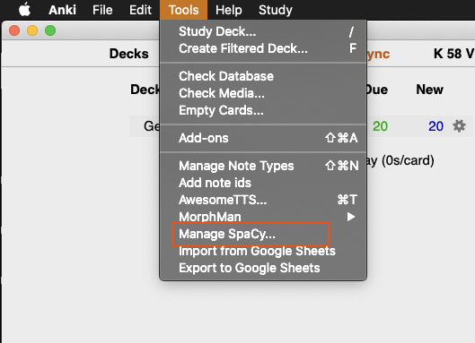

# AnkiSpacy

AnkiSpacy is a package manager for spaCy and its models. By itself it is not very interesting.
But its intent is to provide other Anki addons the power of spaCy without having to package and
distribute Anki.

## How it Works

* The package manager allows you to install spaCy and its models.
* These packages are added to the python sys.path so that they can be used in other Anki addons.
* Hooks emit messages that other Anki addons can listen to to notify them of what packages are
insalled and available for use.

#### The Menu
Once installed the addon will create a `Manage Spacy...` menu item under Anki's `Tools` Menu.



By selecting this menu option you will be presented with the package manager dialog.

#### The Pacakge Manager
TBD 

#### Hooks
TBD

## Development
Setup dev environment (Only tested in OS X).
```
python3 -m venv venv
venv/bin/python -m pip install -r requirements.txt
source ./venv/bin/activate
```

To create a distribution zip
```
inv dist
```


