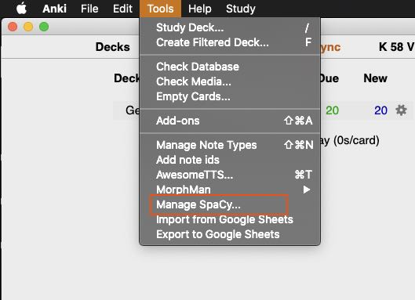
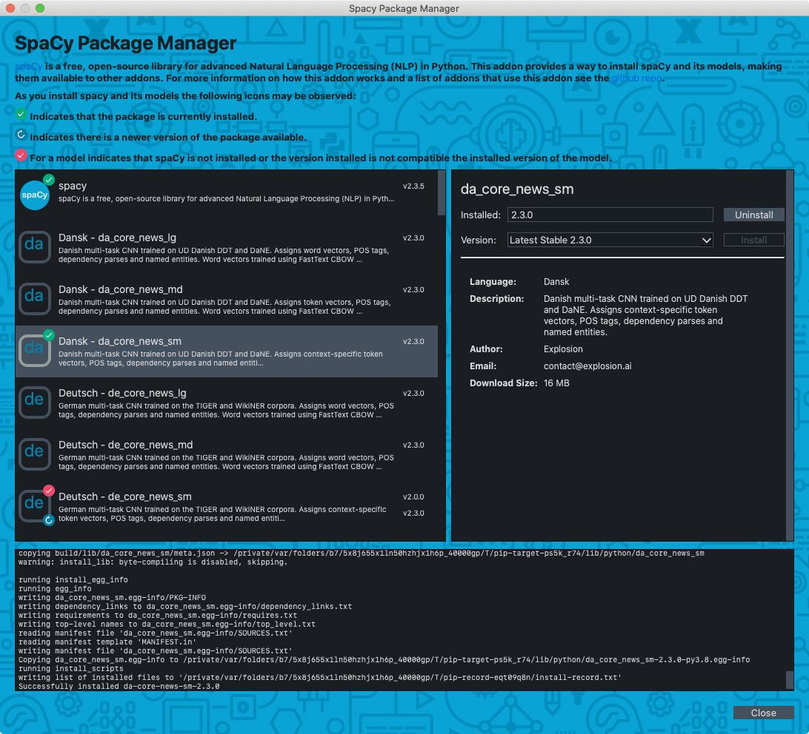

# AnkiSpacy

AnkiSpacy is a package manager for spaCy and its models. By itself it is not very interesting.
But its intent is to provide other Anki addons the power of spaCy without having to package and
distribute spaCy.

## The Menu
Once installed the addon will create a `Manage Spacy...` menu item under Anki's `Tools` Menu.



By selecting this menu option you will be presented with the package manager dialog.

## The Package Manager
The package manager is a dialog that allows you to install spacy and its models. 



The left panel shows a list of packages that can be installed. spaCy appears first in the 
list followed by its models. 

*  Indicates that the package is currently 
        installed.
*  Indicates there is a newer version of the 
        package available.
*  For a model indicates that spaCy is not
        installed or the spaCy version installed is not compatible with the installed version of
        the model.

The right panel allows you to install and uninstall the currently selected package.
Additionally, it provides further information about the package.

At the bottom is a progress and info panel that outputs information as a package is installed.

## Hooks

Other Anki addons can subscribe to the hooks emitted by this addon. As each package is 
installed/uninstalled the sys.path of python is updated so they will be made
available/unavailable to other Anki addons.

|Hook Name                 |Description|
|--------------------------|-----------| 
|AnkiSpacy.spacyInstalled  |Emitted when spaCy is installed via the package manager or during Anki startup if spaCy is already installed.|
|AnkiSpacy.spacyUninstalled|Emitted when spaCy is uninstalled via the package manager.|
|AnkiSpacy.modelAvailable  |Emitted when a model is installed via the package manager or during Anki startup if the model is already installed. This hook will be emitted for all models that are compatible with the currently installed version of spaCy. If the model is not compatible or spaCy is not installed the hook will not emit for that model.|
|AnkiSpacy.modelUnavailable|Emitted when a model is uninstalled via the package manager.|

The hook is emitted with the following dict:

```
{
  'name': <package_name>,
  'version': <installed_version>,
  'path': <installed path>
}
```

`installed_version` will be `None` if the package was uninstalled.


## How it Works

While spaCy and its models are python packages you do not need python installed. 
The addon uses the python shipped with anki to install the packages with pip.

* The package manager allows you to install spaCy and its models.
* These packages are added to the python sys.path so that they can be used in other Anki addons.
* Hooks emit messages that other Anki addons can listen to to notify them of what packages are
insalled and available for use.


## Development
Setup dev environment (Only tested in OS X).
```
python3 -m venv venv
venv/bin/python -m pip install -r requirements.txt
source ./venv/bin/activate
```

To create a distribution zip
```
inv dist
```

## Special Thanks
Thanks to @ianki for helping me figure out how to run pip within Anki's python distribution.
